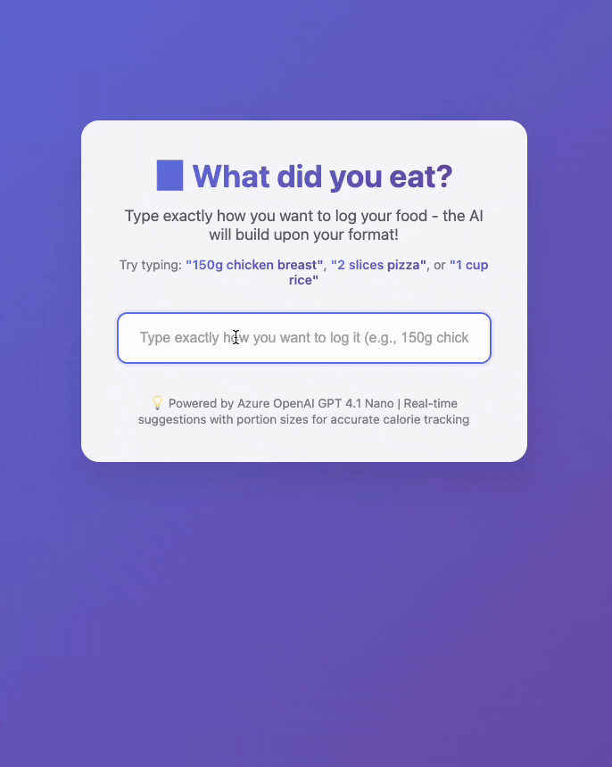

# 🤖 AI Powered Real-time Dish Suggestions

> **AI Powered Real-time dish suggestions with portion sizes for accurate calorie tracking**

An intelligent web application that provides real-time, format-aware food suggestions powered by Azure OpenAI GPT 4.1 Nano. Simply type how you want to log your food, and the AI builds upon your exact format to provide 5 detailed suggestions with accurate portion sizes.

## 🎬 Demo




## ✨ Key Features

- 🎯 **Format-Aware AI**: Respects your exact typing style and measurements
- ⚡ **Real-time Suggestions**: Get 5 instant suggestions as you type (150ms debouncing)
- 📊 **Accurate Portions**: Detailed portion sizes for precise calorie tracking
- 🌍 **Global Cuisine**: Supports dishes from all cuisines worldwide
- 🔒 **Secure Backend**: API credentials safely stored server-side
- 📱 **Mobile Responsive**: Beautiful UI that works on all devices
- ⌨️ **Keyboard Navigation**: Arrow keys and Enter support

## 🚀 How It Works

The AI understands and builds upon your exact input format:

| **Your Input** | **AI Suggestions** |
|---|---|
| `150g chicken breast` | All suggestions use "150g" format |
| `2 slices pizza` | All suggestions use "2 slices" format |
| `1 cup rice` | All suggestions use "1 cup" format |
| `bowl of soup` | All suggestions use "bowl of" format |

## 📋 Prerequisites

- **Python** (3.7 or higher) - [Download here](https://python.org/)
- **Azure OpenAI Access** - Access to Azure OpenAI service with GPT 4.1 Nano deployment

## 🛠️ Installation

1. **Clone the repository**:
   ```bash
   git clone https://github.com/yourusername/ai-powered-dish-suggestions.git
   cd ai-powered-dish-suggestions
   ```

2. **Install dependencies**:
   ```bash
   pip3 install -r requirements.txt
   ```

3. **Set up environment variables**:
   Create a `.env` file in the root directory:
   ```env
   AZURE_OPENAI_API_KEY=your_azure_openai_api_key
   AZURE_OPENAI_ENDPOINT=your_azure_openai_endpoint
   AZURE_OPENAI_DEPLOYMENT_NAME=gpt-4.1-nano
   AZURE_OPENAI_API_VERSION=2025-01-01-preview
   ```

4. **Start the application**:
   ```bash
   python3 app.py
   ```

5. **Open your browser**:
   Navigate to `http://localhost:3000`

## 💡 Usage Examples

### Format-Aware Suggestions

```
Input: "150g chicken breast"
Output:
- 150g Grilled Chicken Breast (boneless, skinless)
- 150g Baked Chicken Breast (herb seasoned)
- 150g Pan-Seared Chicken Breast (with olive oil)
- 150g Poached Chicken Breast (plain)
- 150g Rotisserie Chicken Breast (skin removed)
```

```
Input: "2 slices pizza"
Output:
- 2 Slices Pizza (cheese, thin crust)
- 2 Slices Pizza (pepperoni, regular crust)
- 2 Slices Pizza (veggie, deep dish)
- 2 Slices Pizza (margherita, thin crust)
- 2 Slices Pizza (Hawaiian, stuffed crust)
```

## 🏗️ Project Structure

```
ai-powered-dish-suggestions/
├── .env                 # Environment variables (create this)
├── requirements.txt     # Python dependencies
├── app.py              # Flask backend with Azure OpenAI
├── index.html          # Frontend HTML
├── style.css           # Responsive CSS styling
├── script.js           # Frontend JavaScript logic
└── README.md           # This documentation
```

## 🔧 API Endpoints

- `GET /` - Main application interface
- `POST /suggest` - Get AI-powered food suggestions
- `GET /health` - Health check endpoint
- `GET /test-ai` - Test Azure OpenAI connection

## 🎨 Technical Implementation

### Backend Architecture
- **Flask** server with CORS enabled
- **Azure OpenAI** integration with GPT 4.1 Nano
- **Content filter compliant** prompting
- **Smart response parsing** with multiple fallback methods

### Frontend Features
- **Debounced input** (150ms) for optimal performance
- **Real-time suggestions** with loading indicators
- **Keyboard navigation** support
- **Responsive design** with modern animations

### AI Prompting Strategy
- **Format preservation**: Maintains user's exact typing style
- **Context awareness**: Understands measurements and casual language
- **Global coverage**: Handles dishes from all cuisines
- **Portion intelligence**: Provides realistic serving sizes

## 🚨 Troubleshooting

### Common Issues

1. **"Failed to fetch suggestions"**
   - Ensure server is running (`npm start`)
   - Check your `.env` file has correct Azure OpenAI credentials
   - Verify internet connection

2. **Azure OpenAI errors**
   - Confirm your API key is valid and active
   - Check if your deployment name matches the .env file
   - Ensure you have sufficient quota

3. **Dependencies not found**
   - Run `npm install` to install all required packages
   - Check that you're in the correct directory

### Debug Tips
- Check browser console (F12) for frontend errors
- Monitor server logs for backend issues
- Use the `/test-ai` endpoint to verify Azure OpenAI connection

## 🌟 Contributing

Contributions are welcome! Please feel free to submit a Pull Request. For major changes:

1. Fork the repository
2. Create a feature branch (`git checkout -b feature/AmazingFeature`)
3. Commit your changes (`git commit -m 'Add some AmazingFeature'`)
4. Push to the branch (`git push origin feature/AmazingFeature`)
5. Open a Pull Request

## 📄 License

This project is licensed under the MIT License - see the [LICENSE](LICENSE) file for details.

## 🙏 Acknowledgments

- **Azure OpenAI** for providing the GPT 4.1 Nano model
- **Express.js** community for the excellent web framework
- All contributors who help improve this project

## 📧 Support

If you have any questions or need help, please:
- Open an [issue](https://github.com/yourusername/ai-powered-dish-suggestions/issues)
- Check existing [discussions](https://github.com/yourusername/ai-powered-dish-suggestions/discussions)

---

**Made with ❤️ for better nutrition tracking**

[](https://vercel.com/new/clone?repository-url=https://github.com/yourusername/ai-powered-dish-suggestions)
[](https://heroku.com/deploy?template=https://github.com/yourusername/ai-powered-dish-suggestions)

*Star ⭐ this repository if you found it helpful!* 